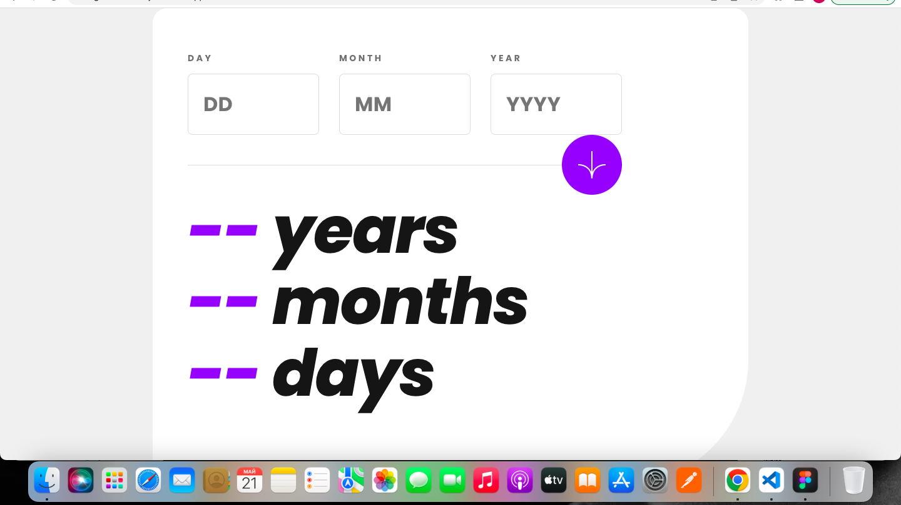

# Frontend Mentor - Age calculator app solution

This is a solution to the [Age calculator app challenge on Frontend Mentor](https://www.frontendmentor.io/challenges/age-calculator-app-dF9DFFpj-Q). Frontend Mentor challenges help you improve your coding skills by building realistic projects. 

## Table of contents

- [Overview](#overview)
  - [The challenge](#the-challenge)
  - [Screenshot](#screenshot)
  - [Links](#links)
- [My process](#my-process)
  - [Built with](#built-with)
  - [What I learned](#what-i-learned)
  - [Continued development](#continued-development)
  <!-- - [Useful resources](#useful-resources) -->
- [Author](#author)
- [Acknowledgments](#acknowledgments)

**Note: Delete this note and update the table of contents based on what sections you keep.**

## Overview

### The challenge

Users should be able to:

- View an age in years, months, and days after submitting a valid date through the form
- Receive validation errors if:
  - Any field is empty when the form is submitted
  - The day number is not between 1-31
  - The month number is not between 1-12
  - The year is in the future
  - The date is invalid e.g. 31/04/1991 (there are 30 days in April)
- View the optimal layout for the interface depending on their device's screen size
- See hover and focus states for all interactive elements on the page
- **Bonus**: See the age numbers animate to their final number when the form is submitted

### Screenshot



### Links

- Solution URL: [https://github.com/FeelsGo-od/FrontendMentor](https://github.com/FeelsGo-od/FrontendMentor)
- Live Site URL: [https://agecalculator-jet.vercel.app/](https://agecalculator-jet.vercel.app/)

## My process

### Built with

- Semantic HTML5 markup
- CSS custom properties
- Flexbox
- Mobile-first workflow
- [React](https://reactjs.org/) - JS library
- [React Redux](https://react-redux.js.org/) - React bindings for Redux
- [React Hook Form](https://react-hook-form.com/) - React hook for form validation
- [Redux toolkit](https://redux-toolkit.js.org/) - opinionated toolset for efficient Redux development for state storing

### What I learned

I learned how to use react form hook(useForm) basics

Look at the code snippet below:

I just needed to add this line to import everything I need
```js
const { register, handleSubmit, watch, formState: { errors } } = useForm();
```
Then, I added onSubmit event with handleSubmit to my form
```html
<form onSubmit={handleSubmit(onSubmit)} className="box-form">
```
I added this line to show validation errors
```js
{errors?.day?.type === "required" && <p className="box-errorTxt">This field is required</p>}
{errors?.day?.type === "min" || errors?.day?.type === "max" && <p className="box-errorTxt">Must be a valid day</p>}
```

These two lines made possible to show the age day,month and year
```js
const diff = new Date(now.valueOf() - birth.valueOf())
return {days: diff.getDate() ,months: diff.getMonth(), years: Math.abs(diff.getFullYear() - 1970)}
```

I reminded to myself that months in date object are 0-bazed values
```js
const birth = new Date(year, month - 1, day)
```

### Continued development

Regular expressions: Even though, I have no regexp in that project, I actually used them when I was trying to write a pattern for form validation. It occured that form hook has "min" and "max" options for input validations which made everything a lot easier. But, I feel like I need to know how to write regexp on at least basic level.

<!-- ### Useful resources

- [Example resource 1](https://www.example.com) - This helped me for XYZ reason. I really liked this pattern and will use it going forward.
- [Example resource 2](https://www.example.com) - This is an amazing article which helped me finally understand XYZ. I'd recommend it to anyone still learning this concept. -->

## Author

- Website - [Andrew Sokolowsky](https://www.andrewdevvv.com/)
- Frontend Mentor - [@FeelsGo-od](https://www.frontendmentor.io/profile/FeelsGo-od)

## Acknowledgments

I want to thank Frontend Mentor website creators for giving a great opportunity to learn a lot of stuff in terms of frontend and project management.
